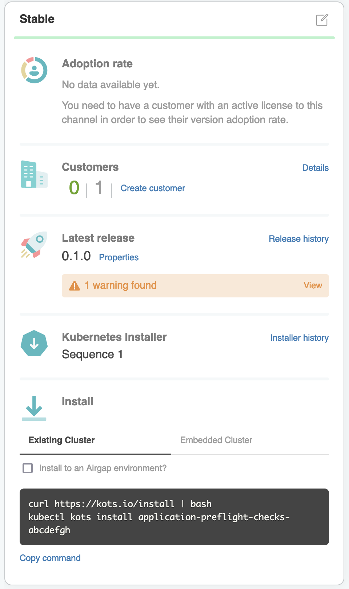

👋 Deploy App using kots cli
============================

**In this exercise you will:**

 * Perform the app install on existing kubernetes cluster using the kots cli
 * Check the kotsadm deployment using the kubernetes cli


### 1. Obtain the kots cli install command

In the Replicated Vendor portal navigate to the Channels page and view the app-preflights channel.
At the bottom of the channel definition there is a code box with the one line install commands for Existing and Embedded clusters.



Copy the code for the Existing Cluster install.

This will take the form of:

```bash
curl https://kots.io/install | bash 
kubectl kots install me-myco-replicated-com/app-preflights
```

### 2. Perform the existing cluster app install

Paste the install command copied in the previous step into the Shell tab window, add the `--no-port-forward` flag at the end of the install command and hit ENTER. The `--no-port-forward` flag will disable automatic port forwarding for the application installer, as we don't need this for this exercise. If you want to know all available flags for the `kots install` command, check out the [reference documentation](https://docs.replicated.com/reference/kots-cli-install). 

The installer will prompt to confirm or change the kubernetes namespace name to create and install in, you can accept the default.
A password will be prompted for too, enter a value you can remember, you will use this later to login to the kotsadm console.

Sample install output:
```
root@kubernetes-vm:~# curl https://kots.io/install | bash
kubectl kots install me-myco-replicated-com/app-preflights --no-port-forward
  % Total    % Received % Xferd  Average Speed   Time    Time     Time  Current
                                 Dload  Upload   Total   Spent    Left  Speed
100  3697  100  3697    0     0   5032      0 --:--:-- --:--:-- --:--:--  5029
Installing replicatedhq/kots v1.85.0 (https://github.com/replicatedhq/kots/releases/download/v1.85.0/kots_linux_amd64.tar.gz)...
######################################################################## 100.0%
Installed at /usr/local/bin/kubectl-kots
Enter the namespace to deploy to: preflights
  • Deploying Admin Console
    • Creating namespace ✓
    • Waiting for datastore to be ready ✓
Enter a new password to be used for the Admin Console: ••••••••••
  • Waiting for Admin Console to be ready ✓

  • To access the Admin Console, run kubectl kots admin-console --namespace preflights

```

### 3. Check the deployment using the kubernetes cli

Once complete you can check the install using `kubectl`:

```bash
kubectl get all -n <your-namespace>
```

Note: Subsitute `<your-namespace>` with the namespace you chose when installing.


```
NAME                           READY   STATUS    RESTARTS   AGE
pod/kotsadm-minio-0            1/1     Running   0          5m12s
pod/kotsadm-postgres-0         1/1     Running   0          5m12s
pod/kotsadm-7f9f9dd674-sbt7n   1/1     Running   0          2m44s

NAME                       TYPE        CLUSTER-IP      EXTERNAL-IP   PORT(S)    AGE
service/kotsadm-minio      ClusterIP   10.43.225.98    <none>        9000/TCP   5m11s
service/kotsadm-postgres   ClusterIP   10.43.211.251   <none>        5432/TCP   5m11s
service/kotsadm            ClusterIP   10.43.147.4     <none>        3000/TCP   2m44s

NAME                      READY   UP-TO-DATE   AVAILABLE   AGE
deployment.apps/kotsadm   1/1     1            1           2m44s

NAME                                 DESIRED   CURRENT   READY   AGE
replicaset.apps/kotsadm-7f9f9dd674   1         1         1       2m44s

NAME                                READY   AGE
statefulset.apps/kotsadm-minio      1/1     5m12s
statefulset.apps/kotsadm-postgres   1/1     5m12s

```

Once done, move onto the next challenge.


🏁 Next
=======

To complete this challenge, press **Check**.
