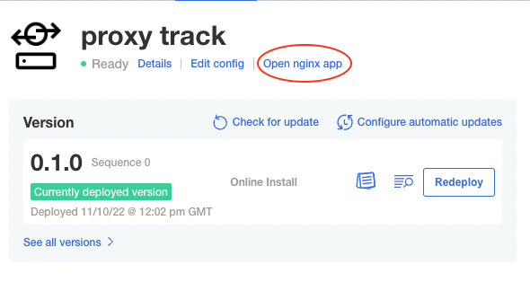

💡 Shell
=========

Install sample application with proxy config in place.

The license file for the application has already been downloaded in the home directory.

Even thought the kurl installer spec included kotsadm which can be see running the application installation can be completed by the command line with the kots install command using the license.

Install using kots cli including license file to upload automatically vs uploading via kotsadm web UI
```
kubectl kots install proxy-$INSTRUQT_PARTICIPANT_ID --skip-preflights --license-file ~/license.yaml --shared-password mytestapp --namespace default --no-port-forward
```

Test access to kotsapp via the KotsAdm tab..

Verify that the application is running using the cli:
```
kubectl get all | egrep 'nginx|NAME'
```

The output should look like this:
```
NAME                                      READY   STATUS    RESTARTS   AGE
pod/nginx-6795d5954c-dlkz9                1/1     Running   0          5m8s
NAME                         TYPE        CLUSTER-IP    EXTERNAL-IP   PORT(S)         AGE
service/nginx                NodePort    10.96.1.61    <none>        80:30888/TCP    5m8s
NAME                                 READY   UP-TO-DATE   AVAILABLE   AGE
deployment.apps/nginx                1/1     1            1           5m8s
NAME                                            DESIRED   CURRENT   READY   AGE
replicaset.apps/nginx-6795d5954c                1         1         1       5m8s
```

The application output can be viewed on the command line using:
```
curl http://isolated-host.$INSTRUQT_PARTICIPANT_ID.instruqt.io:30888/
```

You can also view the application status and output via the KotsAdm UI.
Navigate to the "KotsAdm" tab, login and click on "Details" to see the statusInformers output should be "Ready" (Running okay)
The application can be viewed in the browser by clicking on the "Open nginx app" link.




🏁 Finish
==========
Once the nginx application is running and you have reviewed the application, you can Complete the track.

To Finish this track, press **Check**.
