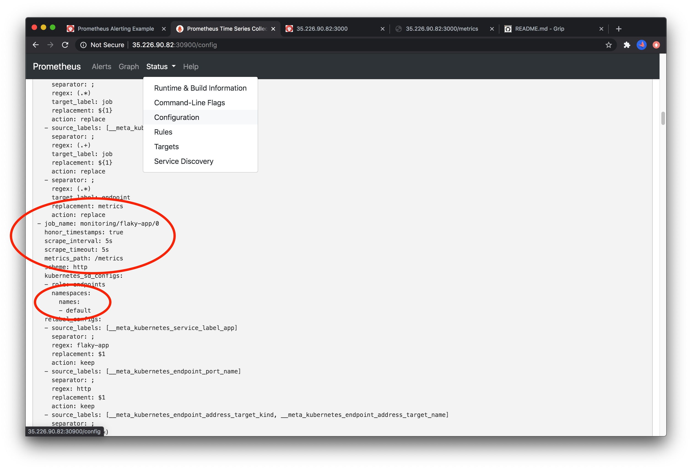

End to End Prometheus Alerting Example
===========

This example demonstrates how to use several KOTS features together with the bundled [kube-prometheus](https://github.com/prometheus-operator/kube-prometheus) stack that comes with [kurl.sh](https://kurl.sh) to configure application-level alerting via webhooks or SMTP emails.


### The Flaky App

In this example, we'll monitor a flaky app called `flaky-app`. Most notably, this app has a indicator `temperature_celsius`. When this value is above `85`, a warning should be triggered. Above a value of `90`, a critical alert should be triggered.

The deployment and service can be found in [./manifests/flaky-app.yaml](./manifests/flaky-app.yaml). The golang source code can be found in [./cmd/flaky-app](./cmd/flaky-app). The frontend is static HTML in [bad_javascript.go](./cmd/flaky-app/bad_javascript.go) (it certainly cannot be described as good javascript by any measure). 

The application stores a single temperature value in memory and has controls and API endpoints to modify the temperature up or down.


Changing the temperature will show a visual state change in the application, and we'll explore how this affects the monitoring systems on the backend.


Most notably, the applicaiton will expose the value of this temperature at `/metrics` for prometheus to pick up


### Monitoring Metrics

Now that we have a metric we can control, it's time to wire it up to prometheus. To do this we need a [ServiceMonitor custom resource](./manifests/flaky-app-servicemonitor.yaml) for the Prometheus operator. We'll deploy this to the `monitoring` namespace so our default prometheus instance will pick it up automatically.

```yaml
apiVersion: monitoring.coreos.com/v1
kind: ServiceMonitor
metadata:
  name: flaky-app
  namespace: monitoring
  labels:
    app: flaky-app
    k8s-app: flaky-app
spec:
  namespaceSelector:
    matchNames:
      - '{{repl Namespace }}'
  selector:
    matchLabels:
      app: flaky-app
  endpoints:
    - port: http
      interval: 5s
```

When this is added to our kots manifests, we should see the prometheus configuration updated with a scrape job for this service:



When this configuration is picked up, an additional prometheus target should be available


We can now graph the value of value of `temperature_celsius` over time using the graph viewer:


**Note for completeness** this project notably *does not* add a graph to the KOTS dashboard [as imgumented on kots.io](https://kots.io/vendor/config/dashboard-graphs/). Doing so *is* encouraged when shipping production applications.

### Temperature Alerting

In order to add an alerting rule for this temperature to match our `85` and `90` degree alert thresholds, we'll add the [./manifests/flaky-app-alertrules.yaml](./manifests/flaky-app-alertrules.yaml) alert rules:

```yaml
apiVersion: monitoring.coreos.com/v1
kind: PrometheusRule
metadata:
  labels:
    prometheus: k8s
    role: alert-rules
  name: flaky-app-high-temperature
  namespace: monitoring
spec:
  groups:
    - name: flaky-app-temperature.rules
      rules:
        - alert: HighTemperatureWarning
          annotations:
            message: Alertmanager has found pod {{ $labels.pod }} with unhealthy temperature of {{ $value }}
          expr: temperature_celsius{service="flaky-app"} > 85
          for: 15s
          labels:
            severity: warning
        - alert: HighTemperatureCritical
          annotations:
            message: Alertmanager has found pod {{ $labels.pod }} with unhealthy temperature of {{ $value }}
          expr: temperature_celsius{service="flaky-app"} > 90
          for: 5s
          labels:
            severity: critical
```

Once this yaml is applied, we should see two alerts in the prometheus dashboard:


Navigating to alert manager on `:30903`, we can also see this alert firing in AlertManager:


### Configuring Alert Sinks

By default, no alerts are configured in alert manager. In this project, we'll configure sending alerts to both a webhook sink and an SMTP email sink.

To demonstrate this easily, the project includes an optional [request bin](http://requestbin.net) container to capture and inspect webhook payloads, and a [MailCatcher](https://mailcatcher.me) container to capture and inspect email alerts. We'll take a look at these shortly. For now, the first step is to write our [kots-config.yaml](./manifests/kots-config.yaml) to display these alerting options to the user:


To convert this config into something alertmanager understands, we create [alertmanager-secret.yaml](./manifests/flaky-app-alertmanager-secret.yaml) which configures the alerting rules for AlertManager:

```yaml
apiVersion: v1
kind: Secret
metadata:
  name: alertmanager-main
  namespace: monitoring
stringData:
  alertmanager.yaml: |
    global:
      resolve_timeout: 5m
      smtp_from: {{repl ConfigOption "smtp_from"}}
      smtp_smarthost: {{repl ConfigOption "smtp_smarthost" | trim }}
      smtp_auth_username: {{repl ConfigOption "smtp_auth_username" | trim }}
      smtp_auth_password: {{repl ConfigOption "smtp_auth_password" | trim }}
      smtp_require_tls: false
    receivers:
      - name: "null"
      - name: webhook
        webhook_configs:
          - url: {{repl ConfigOption "webhook_alert_target_actual" | trim }}
      - name: smtp
        email_configs:
          - to: {{repl (ConfigOption "smtp_to") }}
    route:
      group_by: ["job"]
      group_interval: 10s
      group_wait: 30s
      receiver: "null"
      repeat_interval: 5m
      routes:
    {{repl if ConfigOptionEquals "enable_webhook_alerts" "1"}}
        - match:
            service: flaky-app
          receiver: webhook
    {{repl end}}{{repl if ConfigOptionEquals "enable_smtp_alerts" "1"}}
        - match:
            service: flaky-app
          receiver: smtp
    {{repl end}}
```


Note that this is deployed to the `monitoring` namespace and effectively patches the default AlertManager config that ships with kube-prometheus. An alternative CRD-based AlertManagerConfig method might work, but has not been tested.

Once this is deployed, we can confirm the configuration in AlertManager (it can sometimes take up to 5 minutes to AlertManager to pick up new configuration changes):


To view the actual alerts we can use the links from the flaky-app UI, or the kotsadm dashboard:


In requestbin, we can see the alert payloads:


In mailcatcher, we can see the email alerts:


